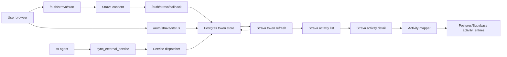

# External Service Activity Sync

This document explains the `sync_external_service` MCP tool. The tool lets an
agent import activities from an external provider into the existing APEX
activity log. The first supported provider is Strava.

The product goal is intentionally small: let the personal trainer agent pull
the user's activities for one day and store them in Supabase/Postgres so daily
summaries and future coaching context can use the same activity table as manual
entries.

## What Is Deployed

- One MCP tool: `sync_external_service`
- One supported service value: `strava`
- One Strava API path for daily activity summaries
- One Strava API path for per-activity details
- One browser helper route pair for Strava OAuth connection:
  `/auth/strava/start` and `/auth/strava/callback`
- One safe Strava status helper at `/auth/strava/status`
- One storage upsert path into `activity_entries`
- One small token table for the latest Strava OAuth token bundle

The existing `activity_entries` table already has `external_source`,
`external_activity_id`, detailed activity fields, JSON payload columns, and a
uniqueness index for external activity ids. The `external_service_tokens` table
stores the latest Strava access token, refresh token, expiry time, and safe
token metadata. Strava token storage is singleton-style by default
(`STRAVA_TOKEN_SUBJECT=strava-singleton`) because this private pilot connects
one athlete account for the agent.

## Tool Usage

```text
sync_external_service(service="strava", day="today")
sync_external_service(service="strava", day="yesterday")
sync_external_service(service="strava", day="2026-04-29")
```

The `day` value is interpreted as a Europe/Madrid wellness day. The sync uses a
local-day Strava query window and then filters by Strava `start_date_local` so
timezone boundaries do not import the wrong day.

The tool returns:

- `service`
- `requested_day`
- `resolved_date`
- `fetched_count`
- `inserted_count`
- `updated_count`
- `skipped_count`
- `activity_ids`
- `warnings`

## Strava Configuration

Set these variables only in local secret files or deployment environment
settings:

```text
STRAVA_CLIENT_ID=your-strava-client-id
STRAVA_CLIENT_SECRET=your-strava-client-secret
STRAVA_REFRESH_TOKEN=your-strava-refresh-token
STRAVA_REDIRECT_URI=https://your-public-domain/auth/strava/callback
STRAVA_SCOPES=read,activity:read_all
STRAVA_TOKEN_SUBJECT=strava-singleton
```

The server can start without these variables. `STRAVA_CLIENT_ID` and
`STRAVA_CLIENT_SECRET` are required when the browser connect helper is used or
when the tool is called with `service="strava"`. `STRAVA_REFRESH_TOKEN` is a
manual recovery seed. The preferred setup is to open `/auth/strava/start`,
grant activity access in Strava, and let `/auth/strava/callback` save the
refresh token in Postgres.

The simple Strava script uses `STRAVA_SCOPE`; this server accepts that alias
when `STRAVA_SCOPES` is not set. Copy the sample script's `STRAVA_SCOPE` value
to `STRAVA_SCOPES` for clarity when moving values into this repo.

This Strava OAuth step is separate from the OAuth connection between the AI
agent and this MCP server. The agent's MCP OAuth token proves it can call the
server; Strava OAuth proves the server can read your Strava activities.

Use the Strava scope `activity:read`. Use `activity:read_all` if private
"Only Me" activities should sync. The default `STRAVA_SCOPES` value is
`read,activity:read_all`.

Use `/auth/strava/status` for a safe diagnostic check. It reports whether
client credentials, an env refresh-token seed, a stored token, and activity
scope are present without returning token values.

Strava may return a rotated refresh token during token refresh. The tool saves
that latest token in Postgres and uses it on later syncs. If a stored token is
rejected with `401`, the tool retries once with the env `STRAVA_REFRESH_TOKEN`
seed and saves the replacement when that succeeds. This keeps normal Strava
rotation out of the operator workflow while still allowing manual recovery by
regenerating and redeploying the env seed.

If Strava returns a `401` with `activity:read_permission`, the token was
authorized without activity access. Reconnect through `/auth/strava/start` and
approve `activity:read` or `activity:read_all`.

## Data Flow



## Mapping And Idempotency

Strava activities are mapped into the current activity row shape:

- `external_source` is `strava`
- `external_activity_id` is the Strava activity id
- `activity_date` comes from `start_date_local`
- `title` comes from Strava `name`
- sport, distance, time, elevation, speed, heart-rate, power, calories, and
  privacy fields are copied when Strava provides them
- the detailed Strava response is stored in `raw_payload`

Re-running sync for the same day is idempotent for each caller. The storage
layer looks up the existing row by subject, source, and external activity id,
then inserts a new row or updates the existing row.

## Future Services

Future services such as Apple Health, Coros, or Garmin should reuse the same
tool shape:

- keep `service` as the dispatcher input
- parse provider data in a small provider-specific mapper
- upsert into `activity_entries` through the same storage method
- keep provider credentials outside the repo

Avoid adding a larger integration framework until more than one provider needs
shared behavior.
