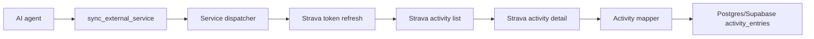

# External Service Activity Sync

This document explains the `sync_external_service` MCP tool. The tool lets an
agent import activities from an external provider into the existing APEX
activity log. The first supported provider is Strava.

The product goal is intentionally small: let the personal trainer agent pull
the user's activities for one day and store them in Supabase/Postgres so daily
summaries and future coaching context can use the same activity table as manual
entries.

## What Is Deployed

- One MCP tool: `sync_external_service`
- One supported service value: `strava`
- One Strava API path for daily activity summaries
- One Strava API path for per-activity details
- One storage upsert path into `activity_entries`

The implementation does not add a new table. The existing `activity_entries`
table already has `external_source`, `external_activity_id`, detailed activity
fields, JSON payload columns, and a uniqueness index for external activity ids.

## Tool Usage

```text
sync_external_service(service="strava", day="today")
sync_external_service(service="strava", day="yesterday")
sync_external_service(service="strava", day="2026-04-29")
```

The `day` value is interpreted as a Europe/Madrid wellness day. The sync uses a
local-day Strava query window and then filters by Strava `start_date_local` so
timezone boundaries do not import the wrong day.

The tool returns:

- `service`
- `requested_day`
- `resolved_date`
- `fetched_count`
- `inserted_count`
- `updated_count`
- `skipped_count`
- `activity_ids`
- `warnings`

## Strava Configuration

Set these variables only in local secret files or deployment environment
settings:

```text
STRAVA_CLIENT_ID=your-strava-client-id
STRAVA_CLIENT_SECRET=your-strava-client-secret
STRAVA_REFRESH_TOKEN=your-strava-refresh-token
```

The server can start without these variables. They are required only when the
tool is called with `service="strava"`.

Use the Strava scope `activity:read`. Use `activity:read_all` if private
"Only Me" activities should sync.

This v1 keeps the Strava refresh token in environment variables only. Strava
may return a rotated refresh token during token refresh. When that happens, the
tool returns a warning and the operator should update `STRAVA_REFRESH_TOKEN` in
local or Vercel environment settings. The tool does not store rotated refresh
tokens in the database.

## Data Flow



## Mapping And Idempotency

Strava activities are mapped into the current activity row shape:

- `external_source` is `strava`
- `external_activity_id` is the Strava activity id
- `activity_date` comes from `start_date_local`
- `title` comes from Strava `name`
- sport, distance, time, elevation, speed, heart-rate, power, calories, and
  privacy fields are copied when Strava provides them
- the detailed Strava response is stored in `raw_payload`

Re-running sync for the same day is idempotent for each caller. The storage
layer looks up the existing row by subject, source, and external activity id,
then inserts a new row or updates the existing row.

## Future Services

Future services such as Apple Health, Coros, or Garmin should reuse the same
tool shape:

- keep `service` as the dispatcher input
- parse provider data in a small provider-specific mapper
- upsert into `activity_entries` through the same storage method
- keep provider credentials outside the repo

Avoid adding a larger integration framework until more than one provider needs
shared behavior.
